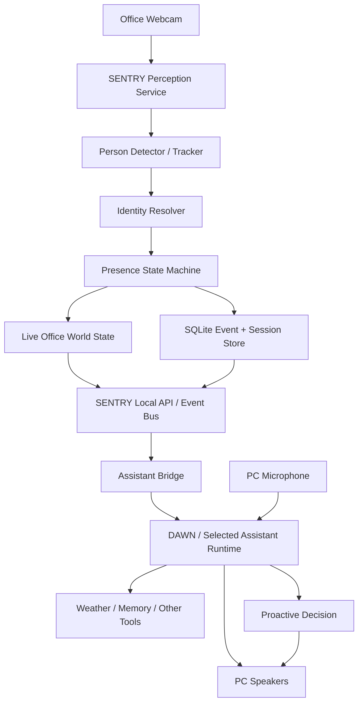

# SENTRY — Formal Project Scope

## 1. Executive Summary

SENTRY is intended to become an embodied household intelligence rather than a conventional voice assistant or security camera. Its long-term purpose is to maintain an evolving understanding of a physical environment: who is present, where they are, what normally happens, what has changed, what people prefer, and when it is useful to speak or act without being explicitly prompted.

The project will **not** begin at whole-home scale. Version 0.1 is a single-room proof of concept located in the office. It runs on the current Ubuntu Linux host and uses only the existing V4L2 webcam, microphone, speakers, canonical Atlas storage, and available GPU/CPU resources. No ESP32s, Home Assistant, Frigate, mmWave, BLE room tracking, Wi-Fi CSI, dedicated Raspberry Pi, TV avatar, or additional cameras are required for the first acceptance gate. Historical Windows/DirectShow evidence remains immutable historical evidence; all future live qualification is Linux/V4L2.

The critical hypothesis to prove is:

> A continuously running AI system can observe one room accurately enough to know whether a person is present, identify the primary user when visual evidence is sufficient, maintain reliable entry/exit sessions and history, expose that live state to a conversational AI, and occasionally initiate useful speech based on context without becoming noisy or intrusive.

If this is not compelling and reliable in one room, the project must not expand simply by adding hardware.

## 2. Project Links

- Notion product/spec authority: https://app.notion.com/p/3c5833cb27ff8065aa88eff1089970a8
- GitHub: https://github.com/SketchOTP/SENTRY
- SSH clone: `git@github.com:SketchOTP/SENTRY.git`
- Preferred assistant foundation under evaluation: https://github.com/The-OASIS-Project/dawn
- Architectural reference: https://github.com/XiaoMi/xiaomi-miloco

## 3. Product Vision

The eventual SENTRY system should feel like an AI resident with a persistent presence rather than software that only wakes when spoken to.

The mature system is expected to:

- Maintain a live world model of rooms, people, devices, and relevant environmental state.
- Recognize consenting household members using multiple evidence sources rather than a single fragile identifier.
- Learn routines statistically from observed history instead of requiring every routine to be manually programmed.
- Remember household facts, preferences, relationships, prior events, and learned patterns.
- Understand transitions such as arriving, leaving, going to work, returning home, settling into a room, or unusual activity.
- Use weather, calendar, reminders, household state, and other tools as context.
- Decide whether information is useful **before** interrupting someone.
- Speak naturally, maintain a stable personality, and learn bounded preferences about how each person wants it to behave.
- Eventually inhabit a persistent visual presence on the main living-room television while its sensing and reasoning remain distributed and server-controlled.

Example long-term behavior:

> A household member is observed following their normal weekday departure sequence. The front-door transition occurs around their usual work departure time. SENTRY knows heavy rain begins shortly. The person has not already been told. SENTRY concludes the information is relevant and says something concise such as, “Rain starts in about twenty minutes. You may want a jacket.”

This example is a **future behavioral target**, not a V0.1 requirement.

## 4. V0.1 Scope — Office Resident Prototype

### 4.1 Hardware

Use only hardware already connected to the main PC:

- Ubuntu Linux x86_64 desktop host.
- One webcam covering the office well enough to see entries and the main occupied area.
- Existing microphone.
- Existing speakers/headphones as appropriate for testing.
- Existing CPU/GPU resources.
- Local disk for configuration, event history, embeddings, logs, and databases.

### 4.2 Required V0.1 Capabilities

SENTRY V0.1 must:

1. Run persistently for long periods without operator babysitting.
2. Acquire the office webcam directly through Linux V4L2, preferring a stable `/dev/v4l/by-id/` path.
3. Detect one or more humans in the camera view.
4. Track detections across frames sufficiently to prevent every frame from becoming a new person.
5. Maintain a stable room state: `empty`, `occupied`, `degraded`, or `offline`.
6. Recognize the enrolled primary user when visual evidence is good enough.
7. Prefer `unknown` over confidently assigning the wrong identity.
8. Support multiple simultaneous people even if only the primary user is enrolled initially.
9. Produce semantic events such as person entered, person identified, person left, room became empty, unknown person entered, camera lost, and camera restored.
10. Persist entry/exit sessions and event history locally.
11. Recover state cleanly after application restart or PC reboot.
12. Make current room state and historical sessions queryable by the AI layer.
13. Provide voice conversation using the PC microphone/speakers through the selected assistant foundation.
14. Allow the AI to initiate speech from a SENTRY event when policy says speaking is worthwhile.
15. Apply cooldowns, deduplication, and interruption budgets so repeated detections do not create repeated speech.
16. Produce sufficient logs and diagnostics to understand why a detection, identity, state transition, or proactive utterance occurred.

### 4.3 Explicit V0.1 Non-Goals

Do **not** implement these before the one-room acceptance gate unless they are strictly necessary to make the prototype function:

- Whole-home deployment.
- ESP32 room nodes.
- Bluetooth room positioning.
- mmWave occupancy sensors.
- Wi-Fi CSI sensing.
- Home Assistant integration.
- Frigate NVR integration.
- Multiple physical rooms.
- Multi-camera cross-camera re-identification.
- Living-room TV avatar or animated character.
- Facial recognition of unconsenting people.
- Continuous cloud video upload.
- General object/action recognition beyond what is needed for reliable person presence.
- Autonomous smart-home control.
- Full behavioral routine learning.
- Security alarm replacement.
- Medical, emergency, or safety-critical monitoring.

These are later capabilities, not reasons to inflate the first build.

## 5. Build-vs-Reuse Strategy

SENTRY should not recreate mature assistant infrastructure unnecessarily.

### 5.1 D.A.W.N. as the Preferred Assistant Foundation

The first implementation should evaluate **D.A.W.N.** as the conversational/persistent assistant layer because it already provides substantial pieces SENTRY would otherwise have to build: voice interaction, local/cloud LLM options, persistent memory, user concepts, tools including weather, scheduler functionality, Web UI voice modes, Home Assistant/MQTT paths for future expansion, and a proactive-attention framework.

SENTRY should treat DAWN as an external upstream project until the integration shape is proven. Do not copy large portions of DAWN into this repository. Determine whether SENTRY can integrate through existing WebSocket, tool, MQTT, API, telemetry, or other extension points. If an upstream modification is genuinely required, document why before creating a fork or vendoring code.

DAWN is GPLv3. Any decision to copy or derive code directly must account for license implications. This project must not silently import incompatible or unexpectedly restrictive source.

### 5.2 Xiaomi Miloco as Architectural Inspiration Only

Miloco demonstrates the desired conceptual loop: perception -> identity -> home memory -> learned preferences/habits -> proactive decision -> action. It is useful as a design reference, especially for proactive household intelligence, but V0.1 must not depend on Xiaomi hardware, Mi Home, or Miloco-specific services.

Do not copy Miloco source into SENTRY without an explicit license review.

### 5.3 Custom SENTRY Code

The code this repository should own is the part not already solved cleanly by the assistant foundation:

- Office camera ingestion.
- Person detection/tracking abstraction.
- Identity/enrollment abstraction.
- Presence state machine.
- Semantic event generation.
- Session/event database.
- Live world-state API.
- Assistant/DAWN bridge.
- Proactive-event policy specific to physical presence.
- Diagnostics and acceptance-test tooling.

## 6. System Architecture



### Architectural Rules

- The LLM is **not** the continuous vision processor.
- Raw video frames should remain local by default.
- Computer-vision components convert frames into structured state/events.
- LLM calls happen because of human conversation or meaningful events, not every frame.
- Perception must continue functioning if the conversational AI is temporarily unavailable.
- The event/session database must remain valid even if DAWN or an LLM crashes.
- All model backends must sit behind interfaces so detector, tracker, face model, or LLM can be replaced later.
- The system must degrade explicitly rather than inventing state when a camera/model fails.

## 7. Office World Model

The authoritative live state should resemble:

```json
{
  "room_id": "office",
  "status": "occupied",
  "occupied": true,
  "person_count": 1,
  "people": [
    {
      "track_id": "track-1842",
      "person_id": "primary_user",
      "display_name": "Tym",
      "identity_confidence": 0.97,
      "identity_state": "recognized",
      "first_seen_at": "2026-08-23T18:21:14-04:00",
      "last_seen_at": "2026-08-23T18:37:42-04:00"
    }
  ],
  "last_transition_at": "2026-08-23T18:21:14-04:00",
  "camera_state": "online",
  "updated_at": "2026-08-23T18:37:42-04:00"
}
```

The system must never equate “camera did not currently detect a face” with “person left.” Presence, tracking, and identity are related but separate concepts.

## 8. Presence State Machine

Frame-by-frame detections are noisy. SENTRY must use temporal hysteresis.

Recommended behavior:

- A person becomes a candidate after initial detection.
- Entry is confirmed only after a configurable minimum evidence window or consecutive detections.
- Short detector dropouts do not end a session.
- Exit is confirmed only after the track has been absent for a configurable grace period.
- Identity can become known after the presence session has already started.
- Re-identification can update confidence during a session.
- If all tracks expire after the grace period, the room becomes empty.
- If the camera is unavailable, room state becomes `degraded` or `offline`; it must **not** report empty as if this were observed truth.

Initial tunable defaults may be approximately:

- Entry confirmation: 1–3 seconds.
- Exit grace period: 10–20 seconds.
- Identity minimum confidence: backend-specific and calibrated, never arbitrary.
- Proactive re-entry cooldown: several minutes unless the event is independently important.

All thresholds must be configuration, not hardcoded magic numbers.

## 9. Identity and Enrollment

V0.1 needs only one enrolled primary person plus `unknown`.

Requirements:

- Provide an explicit enrollment workflow using several local webcam captures or selected images.
- Store derived face embeddings/profile data locally.
- Do not commit enrollment images or biometric profiles to Git.
- Perform identity only when face quality is adequate.
- Aggregate multiple good observations rather than trusting one marginal frame.
- Return `unknown` when confidence is insufficient.
- Wrong-positive identity is considered materially worse than an unknown result.
- Keep person detection functional when the face is turned away or obstructed.
- Design the schema for later multiple consenting household members without implementing whole-house recognition yet.

The exact identity model is replaceable. The AI coder must verify the license of both code **and model weights** before selecting a default. Prototype convenience is not permission to introduce unclear licensing into the repository.

## 10. Event Model

Minimum semantic events:

- `room.camera_online`
- `room.camera_offline`
- `room.became_occupied`
- `room.became_empty`
- `person.entered`
- `person.identified`
- `person.identity_changed`
- `person.left`
- `person.unknown_entered`
- `presence.session_started`
- `presence.session_ended`
- `system.started`
- `system.stopped`
- `system.error`

Canonical event shape:

```json
{
  "event_id": "uuid",
  "event_type": "person.entered",
  "occurred_at": "2026-08-23T18:21:14-04:00",
  "room_id": "office",
  "track_id": "track-1842",
  "person_id": "primary_user",
  "confidence": 0.96,
  "source": "office_webcam",
  "payload": {},
  "schema_version": 1
}
```

Events should be append-only. Corrections should be new events or session updates with provenance rather than destructive rewriting of historical evidence.

## 11. Persistence and Data Model

Use SQLite for V0.1 unless a measured requirement proves it insufficient. Avoid adding PostgreSQL/Redis merely because they may be useful later.

Minimum logical tables:

- `persons` — stable enrolled identities and display metadata.
- `identity_profiles` — backend/version/embedding metadata and enrollment provenance.
- `presence_sessions` — room, person/unknown identity, entry, exit, duration, confidence summary.
- `events` — append-only semantic event log.
- `tracks` or summarized track metadata if required for diagnostics.
- `proactive_actions` — candidate event, decision, action taken, suppression reason, timestamp.
- `settings` or file-based config for calibrated thresholds.
- `schema_migrations` — explicit database versioning.

Do not store every raw video frame. Optional event snapshots may be added later behind configuration and a retention policy.

## 12. Local API and Integration Contract

Provide a small stable local interface so the assistant layer does not depend directly on perception internals.

Minimum API concepts:

- `GET /health`
- `GET /v1/rooms/office/state`
- `GET /v1/rooms/office/sessions`
- `GET /v1/events`
- `GET /v1/persons`
- enrollment/admin endpoints as needed
- live event stream via WebSocket, Server-Sent Events, MQTT, or another justified transport

The precise transport may change after the DAWN integration spike, but the domain contract must stay clean: DAWN should consume **meaningful state and events**, not raw OpenCV objects or frames.

## 13. Conversational AI / DAWN Integration

### Phase-zero integration question

Before deep implementation, inspect current DAWN server-mode documentation and code and identify the least invasive supported way to:

1. Query SENTRY live state from a DAWN conversation.
2. Feed a SENTRY event into DAWN as trusted local context.
3. Allow an event to request a proactive decision without pretending it came from a user.
4. Route the resulting spoken response through the office PC.

Prefer supported upstream extension points. If none exist, build a narrow adapter and document the gap.

### Required conversation examples

The completed prototype should answer from actual SENTRY data:

- “Is anyone in the office?”
- “Who is in here?”
- “When did I come into the office?”
- “How long have I been in here?”
- “Was anyone in the office while I was gone?”
- “When was the office last empty?”

The LLM must not invent answers when SENTRY is offline or history is missing. It should state that the perception source is unavailable or insufficient.

## 14. Voice and Audio

For V0.1, avoid writing a new audio stack unless DAWN cannot meet the requirement.

Preferred path:

- Run DAWN in its supported x86/server configuration.
- Use its browser Web UI on the Windows PC for microphone input, continuous-listening/wake-word mode, and spoken output where practical.
- Keep perception as a separate native Windows service/process.

If browser audio proves unreliable for an always-present office agent, document the failure evidence before implementing native audio ownership.

Required behavior:

- Normal conversational request/response.
- SENTRY can speak proactively without requiring a preceding wake word when policy approves an event.
- User speech should be able to interrupt or supersede long proactive speech.
- Proactive messages should be short.

## 15. Proactive Intelligence

V0.1 is not trying to reproduce full household common-sense intelligence. It must prove the event-to-decision loop safely.

Pipeline:

```text
Physical observation
-> stable semantic event
-> contextual enrichment
-> deterministic eligibility gate
-> optional LLM judgment
-> speak / remain silent
-> record decision and result
```

The deterministic gate should evaluate at least:

- Is the event new or a duplicate?
- Has the same person just re-entered after only a short absence?
- Was a similar message spoken recently?
- Has the hourly interruption budget been exceeded?
- Is confidence high enough?
- Is the assistant already speaking or handling a direct user request?
- Is there actually useful information to convey?

Initial policy should be conservative. Silence is a valid and often preferred action.

Example V0.1 behaviors:

- After a long absence, a recognized arrival may make a pending reminder eligible for delivery.
- An unknown person entering may create a logged event and UI indication without automatically making an alarm-like announcement.
- Repeated camera detections of the same uninterrupted session must never cause repeated greetings.

Every proactive candidate must record whether it spoke and, if not, why it was suppressed.

## 16. Memory and Learning

### V0.1

Use two forms of memory:

1. **Ground-truth event/session memory** owned by SENTRY in SQLite.
2. **Conversational/personal memory** owned by DAWN or the selected assistant foundation.

Do not ask the LLM to be the database of physical events.

### V0.2 routine learning

After the V0.1 system has trustworthy observations, add derived routine features such as:

- Typical office arrival windows by weekday.
- Typical session duration.
- Time-of-day occupancy probability.
- Repeated sequences of absence and return.
- Common long uninterrupted sessions.

Routine learning should begin with transparent statistics, not a black-box model. Store sample count, time window, variance, and confidence. A pattern should not be treated as a “routine” after one or two occurrences.

The eventual whole-home system can extend this to room transitions and departure/arrival patterns.

## 17. Privacy, Security, and Data Boundaries

- Webcam frames remain local by default.
- Continuous raw video is not uploaded to cloud LLMs.
- If a future feature sends a snapshot externally, it must be explicit, configurable, and visible in logs.
- Biometric enrollment data stays local and out of source control.
- Secrets/API keys never enter Git.
- Local APIs bind to localhost by default unless LAN access is deliberately enabled.
- Add authentication before exposing sensitive state beyond localhost.
- Logs should not dump raw biometric embeddings.
- Provide configurable event/session retention.
- The system recognizes only deliberately enrolled people; others remain unknown.
- SENTRY is not represented as a certified security, medical, emergency, or life-safety system.

## 18. Reliability and Failure Handling

Required failure cases:

- Webcam disconnected while running.
- Webcam temporarily busy/unavailable.
- Detector model fails to load.
- Identity model unavailable while person detection still works.
- DAWN unavailable while perception remains running.
- LLM unavailable while state/history remains queryable locally.
- Database temporarily locked/corrupted.
- PC/app restart during an active presence session.

Principles:

- Fail closed on identity: unknown is acceptable; wrong identity is not.
- Fail explicit on occupancy source loss: offline/degraded is not equivalent to empty.
- Preserve event history across assistant failures.
- Use bounded retry/backoff rather than hot retry loops.
- Structured errors must be visible in health/status endpoints and logs.

## 19. Observability

At minimum expose/log:

- camera FPS received and processed
- detector inference latency
- active tracks
- current room state
- identity confidence when evaluated
- state transitions
- event count by type
- suppressed vs spoken proactive candidates
- dropped frames/backpressure
- model/device in use
- database health
- assistant bridge health

Use structured logs. A coder must be able to answer “why did SENTRY think I left?” from evidence rather than guesswork.

## 20. Performance Principles

- Do not process every webcam frame with heavyweight inference if a lower sampling rate meets accuracy goals.
- Camera capture and inference must not block the conversational AI.
- Use GPU acceleration when it materially helps and is stable, but preserve a CPU-capable fallback where practical.
- Bound queues so a slow model creates dropped stale frames rather than minutes of delayed perception.
- Optimize after measuring; do not prematurely build distributed infrastructure.

## 21. Suggested Repository Structure

```text
SENTRY/
├─ README.md
├─ AGENTS.md
├─ pyproject.toml
├─ .env.example
├─ config/
│  └─ sentry.example.toml
├─ docs/
│  ├─ PROJECT_SCOPE.md
│  └─ decisions/
├─ src/sentry/
│  ├─ app.py
│  ├─ config.py
│  ├─ camera/
│  ├─ perception/
│  ├─ identity/
│  ├─ presence/
│  ├─ events/
│  ├─ storage/
│  ├─ api/
│  ├─ assistant/
│  └─ observability/
├─ tests/
│  ├─ unit/
│  ├─ integration/
│  └─ fixtures/
├─ scripts/
│  ├─ run_windows.ps1
│  ├─ enroll_person.ps1
│  └─ soak_test.ps1
└─ data/                  # ignored by Git
```

This is a target shape, not permission to create empty abstraction folders before they are needed.

## 22. Engineering Standards

- Prefer Python for the SENTRY perception/service layer unless measurement proves another language necessary.
- Use explicit typing for public/domain interfaces.
- Pin dependencies reproducibly.
- Add automated tests for state transitions and persistence before tuning models.
- Keep model-specific code behind adapters.
- Separate domain timestamps from display formatting; store timezone-aware timestamps.
- Use schema migrations from the first database version.
- No private webcam recordings, enrollment images, generated databases, API keys, model caches, or large weights in Git.
- No hidden cloud dependency for a feature described as local.
- No “AI guessed the state” fallback when perception data is unavailable.

## 23. Implementation Milestones

### M0 — Bootstrap and DAWN feasibility spike

**Goal:** Prove the assistant foundation and integration approach before deep perception work.

Deliverables:

- Repository scaffold and development instructions.
- DAWN installation/run notes for this Windows/x86 environment.
- Working DAWN Web UI conversation with microphone and spoken response, or documented reason a different assistant foundation is required.
- Written decision describing how SENTRY state/events will reach the assistant.
- Minimal local SENTRY health service.

Acceptance:

- Fresh coder can reproduce the environment from documentation.
- Integration path is demonstrated with a synthetic `person.entered` event before camera work depends on it.

### M1 — Camera and human presence

Deliverables:

- Stable Windows webcam capture.
- Person detector backend.
- Basic tracking.
- FPS/inference diagnostics.

Acceptance:

- Correctly distinguishes empty vs occupied under normal office conditions.
- Multiple people can be represented separately.
- Webcam disconnect produces degraded/offline state, not false empty.

### M2 — Presence sessions and persistence

Deliverables:

- Hysteresis/state machine.
- Entry/exit events.
- SQLite schema/migrations.
- Session history API.

Acceptance:

- Short occlusions do not create false exits/re-entries.
- Restart preserves prior completed sessions.
- Current state is queryable locally.

### M3 — Primary-user identity

Deliverables:

- Enrollment flow.
- Local identity profile.
- Quality/confidence gating.
- Recognized vs unknown states.

Acceptance:

- Primary user is recognized reliably in normal office conditions.
- Poor evidence falls back to unknown.
- No committed biometric data.

### M4 — Conversational grounding

Deliverables:

- Assistant tool/bridge for current state and history.
- Natural-language queries grounded in SENTRY data.
- A bounded localhost API retrieval and allow-listed fact-packet layer.
- Structured `supported` / `partial` / `unavailable` responses with fact citations.

Acceptance:

- Assistant correctly answers the required office-state questions.
- When perception is offline, assistant reports uncertainty/unavailability rather than inventing state.
- Room occupancy is not conflated with primary-user arrival, and restart uncertainty remains explicit.

### M5 — Proactive arrival behavior

Deliverables:

- Event eligibility gate.
- Cooldowns/deduplication/hourly interruption budget.
- Assistant-triggered proactive speech.
- Decision audit log.

Acceptance:

- A controlled arrival scenario can cause one useful spoken message.
- Repeated detections do not repeat it.
- Suppression reasons are inspectable.

### M6 — Soak test and acceptance

Run unattended under normal office use for at least 72 hours.

Validate:

- no runaway memory/process growth
- no recurring crash loop
- camera recovery
- useful logs
- session history accuracy
- identity precision
- absence/entry stability
- proactive speech remains restrained

Only after this milestone passes should V0.2 routine learning begin.

### Owner/operator acceptance override — 2026-08-30

The former 72-hour M6 target is historical scope. The owner/operator explicitly
waived it in favor of the accepted 30-minute final soak. V0.1 was accepted
within its office-only boundary, and V0.2 resident runtime is now the active
phase. V0.2 first establishes supervised continuous collection; routine
statistics and habit learning remain a later, separately authorized slice.

## 24. Quantitative Acceptance Targets

These are prototype gates and may be tuned with documented evidence:

- **Presence:** >=95% correct occupied/empty state over labeled normal-office test intervals.
- **False transitions:** fewer than 1 false entry/exit session transition per 8 hours of representative use.
- **Entry responsiveness:** confirmed entry generally available within 3 seconds of clear visibility.
- **Exit responsiveness:** room-empty transition within configured grace period + a small processing margin, target <=25 seconds after true departure.
- **Identity:** target >=98% precision for accepted primary-user identifications in representative office lighting; uncertain cases should become unknown rather than lower the threshold.
- **Availability:** 72-hour unattended soak test without manual process restart.
- **Persistence:** zero lost completed sessions across normal app restart.
- **Proactivity:** one semantic event produces at most one eligible spoken action unless a new independent event occurs.

Do not game metrics by ignoring difficult intervals. Preserve labeled test evidence and document known failure modes.

## 25. Test Strategy

Tests must include:

- Unit tests for state-machine timing and hysteresis.
- Unit tests for deduplication/cooldown policy.
- Database migration and restart tests.
- API contract tests.
- Recorded/synthetic frame fixtures that do not expose private household footage in the public repository.
- Manual calibration script for the actual office webcam.
- Known-user/unknown-user identity validation.
- Camera unplug/replug test.
- Assistant unavailable/recovery test.
- 72-hour soak report.

Model accuracy should be tested separately from domain-state correctness. A detector can be imperfect while the temporal state machine still produces a stable room state.

## 26. Configuration

At minimum configuration should cover:

- camera device/index/backend
- capture resolution and FPS
- inference sampling rate
- detector backend/model/device
- tracker backend/thresholds
- entry confirmation window
- exit grace period
- identity backend/model/device
- identity threshold/quality threshold
- database path
- log level/path
- API bind host/port
- assistant bridge settings
- proactive cooldown/budget
- timezone

Provide sane defaults and a checked-in example config. Machine-specific config must stay outside source control.

## 27. Decisions the AI Coder Must Not Make Silently

The coder must document before changing any of these:

- Abandoning DAWN for another assistant foundation.
- Uploading continuous webcam/video to a cloud service.
- Replacing local SQLite with external infrastructure.
- Adding ESP32s or additional hardware to make V0.1 pass.
- Introducing a dependency with problematic/unclear licensing.
- Making face recognition permissive enough to increase wrong identities.
- Expanding from office-only to whole-home scope.
- Treating SENTRY as a security/life-safety system.
- Forking or substantially modifying upstream DAWN.

## 28. Future Roadmap — After V0.1 Passes

### V0.2 — Resident runtime foundation

- Run the accepted perception, localhost API, and proactive processor under
  native systemd supervision.
- Start automatically with the configured Ubuntu user session and use bounded
  failure restart/backoff.
- Preserve local SQLite as the active database and Atlas as the complete
  snapshot mirror.
- Accumulate trustworthy longitudinal metadata before deriving routines.

### V0.2 — Routine learning

- Time-of-day/day-of-week occupancy models.
- Stable routine extraction with confidence/sample counts.
- Contextual reminders based on learned office patterns.

### V0.3 — Richer office understanding

- Optional activity/pose signals.
- Object/desk/workstation context where useful.
- Better interruption/context policy.

### V1 — Multi-room household perception

- ESP32/mmWave room presence.
- BLE identity evidence.
- Home Assistant integration.
- Additional cameras/Frigate where useful.
- Cross-room transition/world model.

### V2 — Household resident

- Main living-room TV embodiment/avatar.
- Stable personality and household relationships.
- Multi-person personalized memory/preferences.
- Weather/calendar/contextual departure intelligence.
- Learned routines across the home.
- Appropriate proactive household speech.

### Experimental future research

- Wi-Fi CSI sensing.
- Sound-event classification.
- Cross-camera re-identification.
- More advanced activity understanding.

None of these should compromise the simplicity of the one-room proof.

## 29. Definition of Done for the Office Prototype

SENTRY V0.1 is complete only when all of the following are true:

- It starts reliably on the main PC.
- The webcam perception process can run unattended.
- It knows whether the office is occupied without constant state flicker.
- It recognizes the enrolled primary user with conservative confidence behavior.
- It records accurate entry/exit sessions and meaningful events.
- Historical data survives restart.
- The conversational AI can query live and historical office state.
- The AI can speak proactively because of a real SENTRY event.
- Cooldowns prevent repetitive or annoying announcements.
- Camera/AI failures are represented explicitly.
- A 72-hour soak test passes with documented results.
- Installation, configuration, troubleshooting, and architecture are documented well enough that an AI coder with no conversation history can continue the project from the repository alone.

## 30. AI Coder Handoff / Operating Directive

The coder should treat the Notion SENTRY page and this file as the product contract.

**First action:** inspect the repository and current upstream DAWN documentation/code. Do not begin by building a giant framework. Establish the smallest end-to-end vertical slice:

```text
synthetic office event
-> SENTRY event contract
-> assistant bridge
-> assistant understands the event
-> optional spoken response
```

Then substitute real webcam perception behind the same contract.

Implementation priorities:

1. Reliability over novelty.
2. Grounded state over LLM inference.
3. Conservative identity over false recognition.
4. Useful silence over excessive proactivity.
5. Local processing over unnecessary cloud video.
6. Measured evidence over architecture speculation.
7. Small vertical slices over broad unfinished subsystems.

At the end of every milestone, update repository documentation with what actually works, what remains blocked, how it was tested, and the next bounded milestone. Do not claim capabilities that have not been demonstrated.

## 31. External Reference Basis

- **DAWN:** https://github.com/The-OASIS-Project/dawn — open-source assistant foundation currently providing voice, memory, local/cloud LLM support, Web UI, tools, smart-home paths, and proactive-attention concepts relevant to SENTRY.
- **Xiaomi Miloco:** https://github.com/XiaoMi/xiaomi-miloco — architectural reference for whole-home perception, identity recognition, home memory, habits, tasks, and proactive household intelligence.

These references can evolve. Verify current upstream behavior before depending on a particular API or implementation detail.

---

**Project state at creation:** Scope defined; implementation not yet started. **Current authorized work:** M0 only, followed by milestones in order unless evidence requires a documented change.

## Current post-V0.1 state — 2026-08-30

V0.1 and the V0.2 resident runtime are accepted. The V0.2 routine-statistics
foundation is now qualified: schema-v5 append-only derived snapshots, four
transparent routine types, timezone-aware circular/robust statistics,
observability exclusions, maturity gates, localhost `/v1/routines`, and an
independent user-systemd refresh timer. Current natural history is sparse, so
the production snapshots correctly remain `insufficient`. Routine facts remain
derived and are not yet used by M4 conversation or M5 proactivity; that use
requires a later Architect directive.
